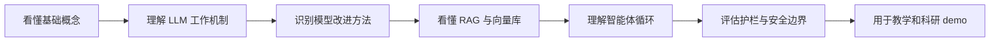
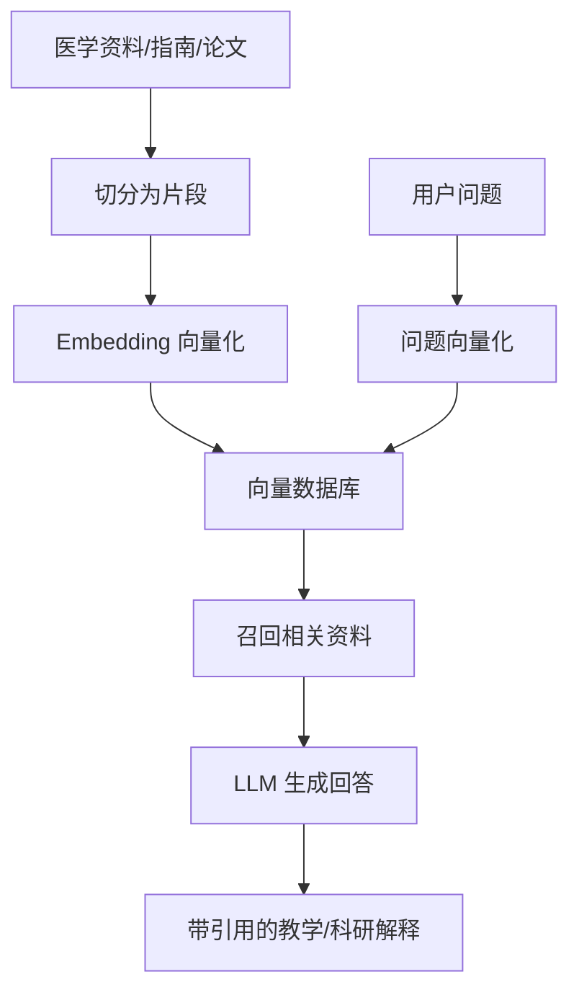
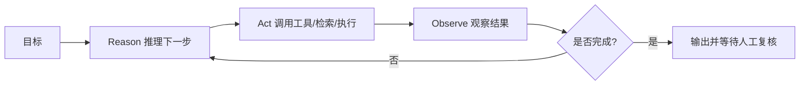
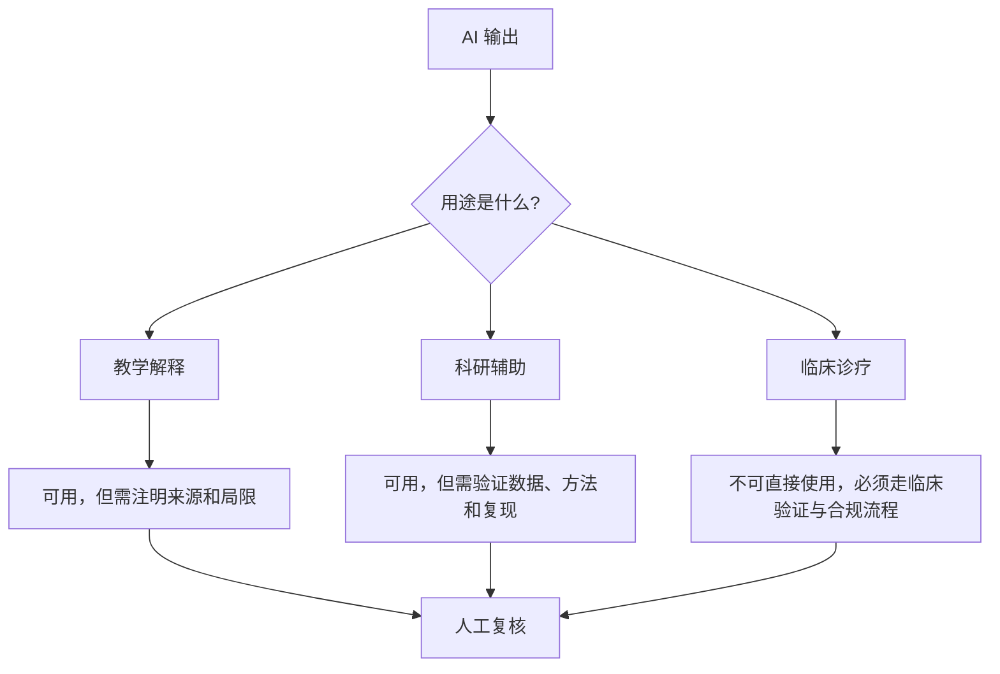

# 框架图与流程

## 学习路线

```mermaid
flowchart LR
  A["看懂基础概念"] --> B["理解 LLM 工作机制"]
  B --> C["识别模型改进方法"]
  C --> D["看懂 RAG 与向量库"]
  D --> E["理解智能体循环"]
  E --> F["评估护栏与安全边界"]
  F --> G["用于教学和科研 demo"]
```

## RAG 与向量数据库

```mermaid
flowchart TD
  A["医学资料/指南/论文"] --> B["切分为片段"]
  B --> C["Embedding 向量化"]
  C --> D["向量数据库"]
  E["用户问题"] --> F["问题向量化"]
  F --> D
  D --> G["召回相关资料"]
  G --> H["LLM 生成回答"]
  H --> I["带引用的教学/科研解释"]
```

## 智能体 ReAct 循环

```mermaid
flowchart LR
  A["目标"] --> B["Reason 推理下一步"]
  B --> C["Act 调用工具/检索/执行"]
  C --> D["Observe 观察结果"]
  D --> E{"是否完成?"}
  E -->|否| B
  E -->|是| F["输出并等待人工复核"]
```

## 医疗 AI 安全边界

```mermaid
flowchart TD
  A["AI 输出"] --> B{"用途是什么?"}
  B --> C["教学解释"]
  B --> D["科研辅助"]
  B --> E["临床诊疗"]
  C --> F["可用，但需注明来源和局限"]
  D --> G["可用，但需验证数据、方法和复现"]
  E --> H["不可直接使用，必须走临床验证与合规流程"]
  F --> I["人工复核"]
  G --> I
  H --> I
```
